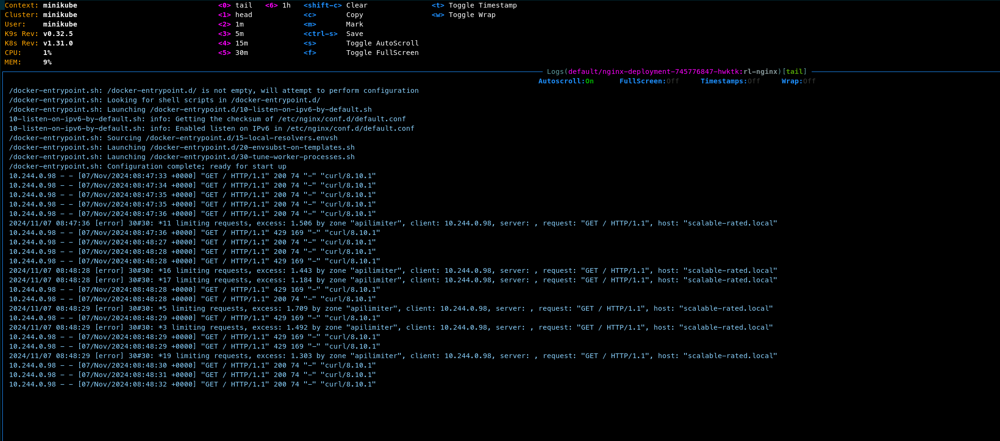

Возмём тот же сервис из упражнения 3.

Развернем nginx в кластере
```shell
kubectl apply -f nginx-deployment.yaml
```

Развернем Ingress для доступа к сервису через Nginx
```shell
 kubectl apply -f nginx-ingress.yaml
```

Выполним проверку "подергая" несколько раз сервис.
```shell
curl -o /dev/null -w '%{http_code}' -s 'http://scalable-rated.local/' --insecure
```

В результате, при запросе чаще чем 1 раз в секунду мы будем получать 429 код, как на картинке



Итого, конфиг файл для Nginx выглядит следующим образом  
```nginx configuration
 events {
      worker_connections  1024;
    }
    
http {
  upstream backend_servers {
     server scalable-service.default.svc.cluster.local;
  }

  limit_req_zone $remote_addr zone=apilimiter:10m rate=1r/s;
  server {
     listen 8080;
     location / {
        limit_req zone=apilimiter burst=1 nodelay;
        limit_req_status 429;
        
        proxy_pass http://backend_servers;
     }
  }
}
```